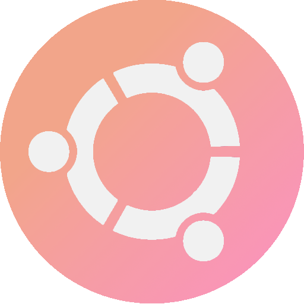
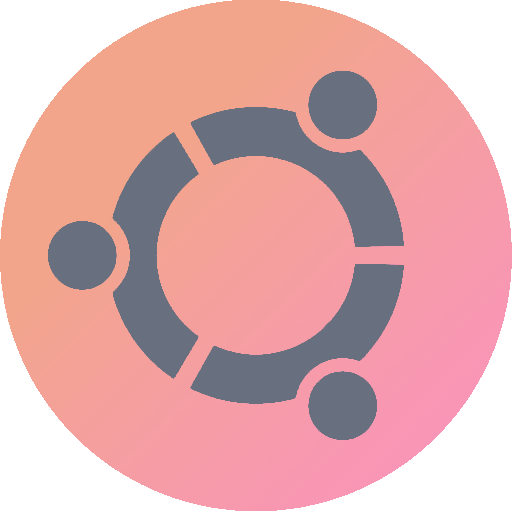

<p align="center">
  <a name="top" href="#octocat-hi-there-thanks-for-visiting-">
     
  </a>
</p>

<p align="center">
  <a href="#rice_scene--setup">
    
  </a>
  <a href="https://github.com/owl4ce/dotfiles/wiki/Keybinds">
    
  </a>
  <a href="https://deviantart.com/owl4ce/gallery/76024204/joyful-desktop-v3">
    
  </a>
  <a href="#user-configuration">
    
  </a>
</p>

##  
### :octocat: Hi there! Thanks for visiting! 

<a href="https://github.com/owl4ce/dotfiles/releases/tag/3.1">
  
</a>

This is my **personal configuration** for my favorite openbox window manager and some applications too.

I hope you understand everything here. :wink:

Here are some details about my setup
- **Window Manager**               • [Openbox](http://openbox.org/wiki/Main_Page) :art: 4 changable mode!
- **Display Manager**              • [SLiM](https://github.com/iwamatsu/slim) :blossom: beautiful UI! <kbd>deprecated</kbd>
- **Shell**                        • [Zsh](https://www.zsh.org/) :shell: with [oh my zsh](https://github.com/ohmyzsh/ohmyzsh) framework! <kbd>optional</kbd>
- **Terminal**                     • [URxvt](http://software.schmorp.de/pkg/rxvt-unicode.html), [Termite](https://github.com/thestinger/termite) <kbd>available</kbd>
- **Openbox Menu**                 • [Obmenu-generator](https://github.com/trizen/obmenu-generator)
- **Panel**                        • [Tint2](https://gitlab.com/o9000/tint2) :shaved_ice: material icon font!
- **Compositor**                   • [Picom](https://github.com/yshui/picom) :doughnut: rounded corners!
- **Notify Daemon**                • [Dunst](https://github.com/dunst-project/dunst) :leaves: minimalism!
- **Application Launcher**         • [Rofi](https://github.com/davatorium/rofi) :rocket: blazing fast!
- **File Manager**                 • [Thunar](https://github.com/xfce-mirror/thunar) :bookmark: customized sidebar & icon!
- **GUI & CLI IDE**                • [Geany](https://www.geany.org/), [Neovim](https://neovim.io/)

## :gift: Changelogs 

<a href="https://www.deviantart.com/owl4ce/art/Joyful-Desktop-v3-862516153">
  
</a>

<details>
  <summary><strong>v3.0</strong></summary>
  
  - **Visual Mode**:
    - Both modes (minimal) have their own window button styles, margins, sidebar rofi, and dunst layouts.
    - Removed eyecandy tint2 from Joyful Desktop v2
    - Better Tint2 (added temp executor, etc.)
    - Added rotation mode (crossover, except minimal mode.)

  - **Major Changes**:
    - Removed SLiM sync background, custom slim themes, and unnecessary files/config.
    - All scripts are reproduced all with central variables in one [file](./.owl4ce_var). 
    - Reverse terminal background and foreground (urxvt/termite)
    - Nvim Config - Thanks to [@elenapan](https://github.com/elenapan/dotfiles)
    - SLiM Themes (optional) - See [here](#user-configuration)
    - URxvt Font Resizer - See [keybinds](https://github.com/owl4ce/dotfiles/wiki/Keybinds#urxvt)
    - Included [Networkmanager_dmenu](./.local/bin/networkmanager_dmenu)
    - Oh My ZSH Theme - [Rounded](./.oh-my-zsh/custom/themes/rounded.zsh-theme)
    - Rofi v1.6.0 Supported
    - New Ncmpcpp UI
    - Neofetch Images
    - New Wallpapers
    
</details>

<details open>
  <summary><strong>v3.1</strong></summary>
  
  - **Screenshot Script**: Rounded corners, quality, shadows.
  - Terminal UI improvements, particularly font size
  - Bug fixes and improvements [<kbd>keep looking</kbd>](https://github.com/owl4ce/dotfiles/commits/main)
  - Rounded picom as default
  - New Wallpapers
  
</details>
  
## :rice_scene:  Setup
This is how to install these dotfiles for automatic settings OpenboxWM custom environment.

##  

### Introduction of Linux Rice

<details>
<summary>Please read <a target="_blank" href="https://crispgm.com/page/the-fascinating-arch-linux-rice.html">this</a> and <a target="_blank" href="https://jie-fang.github.io/blog/basics-of-ricing">this</a>.</summary>
  
<br>

<p align="center"><a href="#introduction-of-linux-rice"></a></p>

</details>

##  

### Installation (dependencies)
> Adjust your choice about dependencies below, this is my complete setup as I use single OS, single OpenboxWM with multimedia application that I use.
>   
> **Detailed environment**  
> Please refer to [wiki/Detailed-Environment](https://github.com/owl4ce/dotfiles/wiki/Detailed-Environment).
>   
> **Warning!** This configuration is highly dependent to `bash`, `sed`, and `coreutils`.  
> Assume that you are using [`sudo`](https://www.sudo.ws/) or [`doas`](https://github.com/Duncaen/OpenDoas).

  <details open>
  <summary><strong>Debian & Ubuntu (and all based distributions)</strong></summary>
  
   ```bash
   $ sudo apt install rsync python psmisc imagemagick ffmpeg wireless-tools openbox alsa-utils brightnessctl nitrogen dunst tint2 gsimplecal rofi qt5-style-plugins lxpolkit xautolock rxvt-unicode xclip scrot thunar thunar-archive-plugin thunar-media-tags-plugin thunar-volman ffmpegthumbnailer tumbler viewnior mpv mpd mpc ncmpcpp pavucontrol parcellite neofetch w3m w3m-img htop playerctl xsettingsd
   ```

  </details>
  
  <details>
  <summary>oh-my-zsh & plugins <kbd>optional</kbd></summary>
  
   ```bash
   $ sudo apt install zsh
   ```
   ```bash
   $ chsh -s `which zsh` # Change default shell to zsh for current user
   ```
   ```bash
   $ sh -c "$(curl -fsSL https://raw.githubusercontent.com/ohmyzsh/ohmyzsh/master/tools/install.sh)"
   ```
   ```bash
   $ git clone https://github.com/zsh-users/zsh-syntax-highlighting.git ${ZSH_CUSTOM:-~/.oh-my-zsh/custom}/plugins/zsh-syntax-highlighting
   ```
   ```bash
   $ git clone https://github.com/zsh-users/zsh-autosuggestions.git ${ZSH_CUSTOM:-~/.oh-my-zsh/custom}/plugins/zsh-autosuggestions
   ```
   ```bash
   $ git clone https://github.com/zsh-users/zsh-completions.git ${ZSH_CUSTOM:=~/.oh-my-zsh/custom}/plugins/zsh-completions
   ```
    
  </details>
  
  <details>
  <summary>picom</summary>
    
   ```bash
   $ sudo apt install libxext-dev libxcb1-dev libxcb-damage0-dev libxcb-xfixes0-dev libxcb-shape0-dev libxcb-render-util0-dev libxcb-render0-dev libxcb-randr0-dev libxcb-composite0-dev libxcb-image0-dev libxcb-present-dev libxcb-xinerama0-dev libxcb-glx0-dev libpixman-1-dev libdbus-1-dev libconfig-dev libgl1-mesa-dev  libpcre2-dev  libevdev-dev uthash-dev libev-dev libx11-xcb-dev
   ```
   ```bash
   $ git clone https://github.com/yshui/picom.git && cd picom/
   ```
   ```bash
   $ git submodule update --init --recursive
   ```
   ```bash
   $ meson --buildtype=release . build
   ```
   ```bash
   $ ninja -C build
   ```
   ```bash
   $ ninja -C build install
   ```

  </details>

  <details>
  <summary>obmenu-generator</summary>
  
   > I haven't tested it yet.
  
   ```bash
   $ sudo su
   ```
   ```bash
   echo 'deb http://download.opensuse.org/repositories/home:/Head_on_a_Stick:/obmenu-generator/Debian_10/ /' > /etc/apt/sources.list.d/home:Head_on_a_Stick:obmenu-generator.list
   ```
   ```bash
   wget -nv https://download.opensuse.org/repositories/home:Head_on_a_Stick:obmenu-generator/Debian_10/Release.key -O Release.key
   ```
   ```bash
   apt-key add - < Release.key
   ```
   ```bash
   apt update
   ```
   ```bash
   apt install obmenu-generator libgtk2-perl
   ```
    
   [See Installation from Git](https://github.com/trizen/obmenu-generator/blob/master/INSTALL.md)
  
  </details>
  
  <br>
  
  <details open>
  <summary><strong>Arch Linux (and all based distributions)</strong></summary>
  
   > Make sure your **AUR Helper** is [`yay`](https://github.com/Jguer/yay) or [`paru`](https://github.com/Morganamilo/paru).
  
   ```bash
   $ yay -S rsync python psmisc imagemagick ffmpeg wireless_tools openbox alsa-utils brightnessctl nitrogen dunst tint2 gsimplecal rofi qt5-styleplugins lxsession xautolock rxvt-unicode-patched xclip scrot thunar thunar-archive-plugin thunar-media-tags-plugin thunar-volman ffmpegthumbnailer tumbler viewnior mpv mpd mpc ncmpcpp pavucontrol parcellite neofetch w3m htop picom-git obmenu-generator gtk2-perl playerctl xsettingsd
   ```

  </details>
  
  <details>
  <summary>oh-my-zsh & plugins <kbd>optional</kbd></summary>
  
   ```bash
   $ sudo pacman -S zsh
   ```
   ```bash
   $ chsh -s `which zsh` # Change default shell to zsh for current user
   ```
   ```bash
   $ sh -c "$(curl -fsSL https://raw.githubusercontent.com/ohmyzsh/ohmyzsh/master/tools/install.sh)"
   ```
   ```bash
   $ git clone https://github.com/zsh-users/zsh-syntax-highlighting.git ${ZSH_CUSTOM:-~/.oh-my-zsh/custom}/plugins/zsh-syntax-highlighting
   ```
   ```bash
   $ git clone https://github.com/zsh-users/zsh-autosuggestions.git ${ZSH_CUSTOM:-~/.oh-my-zsh/custom}/plugins/zsh-autosuggestions
   ```
   ```bash
   $ git clone https://github.com/zsh-users/zsh-completions.git ${ZSH_CUSTOM:=~/.oh-my-zsh/custom}/plugins/zsh-completions
   ```
  
  </details>

  <br>
  
  <details>
  <summary><strong>Another Linux Distribution</strong></summary>
  
   Customize/port dependencies yourself!  
   
   **For example**  
   - [Gentoo/Linux](https://packages.gentoo.org/)
   - [Void (Linux)](https://voidlinux.org/packages/)

   > For Gentoo/Linux, I recommend to enabling [`keywords`](https://wiki.gentoo.org/wiki/ACCEPT_KEYWORDS) for specific packages and/or using `ebuild-9999`.
  
   **If it's not there, compile it manually from git source code or from elsewhere.**
  
  </details
  
  <br>
    
  **Optional**: [betterdiscord](https://betterdiscord.net/), [geany](https://geany.org/) + [geany plugins](https://plugins.geany.org/), [gimp](https://www.gimp.org/), [lxappearance](https://wiki.lxde.org/en/LXAppearance), [nano](https://www.nano-editor.org/) + [nano syntax highlighting](https://github.com/scopatz/nanorc), [neovim](https://neovim.io/), [obconf](http://openbox.org/wiki/ObConf:About), [slim](https://wiki.archlinux.org/index.php/SLiM), [spotify](https://www.spotify.com/us/download/linux/), [termite](https://www.compuphase.com/software_termite.htm), [xfce4-power-manager](https://docs.xfce.org/xfce/xfce4-power-manager/getting-started).
  
  **Suggested replacement commands**
  - `ls` ➜ [`exa`](https://github.com/ogham/exa)  
  
    [`~/.zshrc`](./.zshrc)  
    ```cfg    
    ...
    
    130 alias ls="exa -lgh --icons --group-directories-first"
    131 alias la="exa -lgha --icons --group-directories-first"
    
    ...
    ```
    
  - `cat` ➜ [`bat`](https://github.com/sharkdp/bat)  
  
    [`~/.zshrc`](./.zshrc)  
    ```cfg    
    ...
    
    146 export BAT_THEME="base16"
    ```

##  

### Installation (dotfiles)
  
  <details open>
  <summary><strong>Most of .files</strong></summary>
  
   You can clone or download it as a zip. After that put all files in the **dotfiles** folder to user's home directory.
   > Assume you are cloning in the `~/Documents` directory for example.
   ```bash
   $ git clone https://github.com/owl4ce/dotfiles.git && cd dotfiles/
   ```
   
   I recommend with rsync.
   ```bash
   $ rsync -avxHAXP --exclude '.git*' .* ~/
   ```
   > **Explanation**
   > | Options   | Function                                            |
   > |:---------:|-----------------------------------------------------|
   > | -a        | all files, with permissions, etc..                  |
   > | -v        | verbose, mention files                              |
   > | -x        | stay on one file system                             |
   > | -H        | preserve hard links (not included with -a)          |
   > | -A        | preserve ACLs/permissions (not included with -a)    |
   > | -X        | preserve extended attributes (not included with -a) |
   > | -P        | show progress                                       |
   > | --exclude | exclude files matching PATTERN                      |
   >
   > **Differences**  
   > - `cp` is for duplicating stuff and by default only ensures files have unique full path names.
   > - `rsync` is for synchronising stuff and uses the size and timestamp of files to decide if they should be replaced. It has many more options and capabilities than `cp`.
   >
   >   
   > I recommend to not deleting **dotfiles** folder after cloning from this repository, because to make upgrades easier. Read the [update](#update) section.
  
  </details>

  <details open>
  <summary><strong>Icons</strong></summary>

   ```bash
   $ cd ~/.icons && tar -Jxvf Papirus-Custom.tar.xz && tar -Jxvf Papirus-Dark-Custom.tar.xz
   ```
   ```bash
   $ sudo ln -s ~/.icons/Papirus-Custom /usr/share/icons/Papirus-Custom
   ```
   ```bash
   $ sudo ln -s ~/.icons/Papirus-Dark-Custom /usr/share/icons/Papirus-Dark-Custom
   ```
   > **Why I need to link icons to user system resources?**  
     That's needed by dunst in order to display most of icon from notification that spawned by application.
   >   
   > **Why not just move it directly to user system resources?**  
     Actually it's up to you, but I recommend sticking to `~/.icons` plus link to `/usr` because I'm using [Arch on top of other linux distributions](https://github.com/owl4ce/archroot) with same homedir. More effective than copying icons to both roots.
     
  </details>

  <details open>
  <summary><strong>Refresh Font Cache</strong></summary>
  
   ```bash
   $ fc-cache -rv
   ```
    
  </details>

  <details open>
  <summary><strong>Root Privileges with <a href="https://en.wikipedia.org/wiki/Setuid#SUID">SUID</a></strong></summary>
  
   - `poweroff`
   - `reboot`
   - `brightnessctl`
   - *others if needed*
   ```bash
   $ sudo chmod u+s $(command -v {poweroff,reboot,brightnessctl})
   ```
   > For `brightnessctl` I recommend [adding users to video group](https://wiki.archlinux.org/index.php/Users_and_groups#Group_ma</strong>nagement).
    
  </details>
  
### The step you are waiting for
The final step is login into openbox-session, basically login from display manager you use such as lightdm, gdm, etc.

> **I recommend to [configuring](#user-configuration) what you want first, before logging into openbox-session.**

If you are using `~/.xinitrc`, simply add
**Systemd Linux Distribution**  
```cfg
exec openbox-session
```

**Non-Systemd Linux Distribution**  
```cfg
exec dbus-launch --exit-with-session openbox-session
```

##  

### Update
Since I suggested using rsync from start, the easiest way is to list the files that will not be updated to avoid changing personal files with files in this repository. First, update local repository with git repository.
> Remember where you cloned this repository.
```bash
$ cd dotfiles/ && git pull
```
Then list the files excluded by rsync. For example,  
`~/rsync_exfiles`
```cfg
1 .git*
2 .lyrics
3 mpd.state
4 current-track
5 .zshrc
6 .nanorc
7 nvim
8 mpv

...
```
and whatever the file is. Next, of course is rsync.
```bash
$ rsync -avxHAXP --exclude-from ~/rsync_exfiles .* ~/
```

##  

### User configuration
- **SLiM Themes <kbd>optional</kbd>**
  <details>
  <summary><strong>See</strong></summary>
  
    <p align="center">In fact, I use SLiM just for lockscreen.</p>
    
    <p align="center"><a href="https://www.deviantart.com/owl4ce/art/Floflo-Batik-SLiM-Themes-861519439">
      
    </a></p>
    
    <p align="center">Just click on the image above!</p>
    
  </details>

- **Chromium-based web browser <kbd>suggested</kbd>**
  <details>
  <summary><strong>See</strong></summary>
  
    **Settings**: `chrome://settings/`
    - Themes: `Use GTK+`
    - `Use system title bar and borders`
    
    <br>
    
    <p align="center"><a href="https://brave.com/"></a></p>

  </details>
  
- **Spotify - Spicetify Theme <kbd>suggested</kbd>**
  <details>
  <summary><strong>See</strong></summary>
  
    <br>
    
    <p align="center"><a href="https://github.com/owl4ce/spicetify-themes/tree/master/Dribbblish#mechanical">
    
    </a></p>
    <p align="center"><a href="https://github.com/owl4ce/spicetify-themes/tree/master/Dribbblish#eyecandy">
    
    </a></p>
    
    <p align="center">Just click on the image above!</p>
    
  </details>
  
- **Capitaine Cursors Theme <kbd>suggested</kbd>**
  <details>
  <summary><strong>See</strong></summary>
  
    <br>
    
    <p align="center"><a href="https://www.pling.com/p/1148692">
    
    </a></p>
    <p align="center"><a href="https://www.pling.com/p/1148692">
    
    </a></p>
    
    <p align="center">Just click on the image above!</p>
    
  </details>
  
- **User's Tray Icons**  
  [`~/.config/openbox/tray`](./.config/openbox/tray)  
  An example is turning on `nm-applet`, because by default I don't use it and use [networkmanager_dmenu](./.local/bin/networkmanager_dmenu) instead.

  > **How about battery indicator?**  
  > Because on the tint2 panel I turned off battery status. Alternatively, install `xfce4-power-manager` and enable system tray icon in `xfce4-power-manager-settings`.

  Remove hashtags for all your needs, then re-login openbox-session.
  
  > **Warning!** Putting a tray here means that when switching modes, the program will be restarted.
  ```cfg
  1 #
  2 # This tray will restart after changing visual mode
  3 # Please add "&" after command
  4 #
  5 # ---
  6
  7 parcellite &
  8 #nm-applet &
  9 #xfce4-power-manager &
  ```
  
- **Dunst Notification Action - Default Web Browser**  
  > <kbd>`middle click`</kbd>
  
  [`~/.config/dunst/dunstrc-mech`](./.config/dunst/dunstrc-mech)  
  [`~/.config/dunst/dunstrc-mech-MINMOD`](./.config/dunst/dunstrc-mech-MINMOD)  
  [`~/.config/dunst/dunstrc-eyc`](./.config/dunst/dunstrc-eyc)  
  [`~/.config/dunst/dunstrc-eyc-MINMOD`](./.config/dunst/dunstrc-eyc-MINMOD)
  ```cfg
  ...
  
  42 browser = brave-bin
  
  ...
  ```
  
- **URxvt - Default Web Browser**  
  > <kbd>`middle click`</kbd>
  
  [`~/.Xresources`](./.Xresources)
  ```cfg
  ...
  
  63 URxvt.url-select.launcher:        brave-bin
  
  ...
  ```
  [See keybinds](https://github.com/owl4ce/dotfiles/wiki/Keybinds#urxvt)
  
- **URxvt - Application Icon**  
  [`~/.Xresources`](./.Xresources)
  ```cfg
  ...
  
  17 URxvt.iconFile:                   /home/username/.icons/gladient/term.png
  
  ...
  ```
  
- **URxvt - Transparent Background <kbd>optional</kbd>**    
  <details>
  <summary>If you want to turn on transparency on urxvt, follow this step.</summary>
  
    [`~/.Xresources`](./.Xresources)
  
    ```cfg
    ...

    15 URxvt.depth:                      32

    ...

    68 #define black0                    [90]#373E4D

    ...

    84 #define white0                    [90]#F9F9F9

    ...
    ```
    `[90]` is the opacity level that will be applied to urxvt. After that do this to reload configuration.
    ```bash
    $ xrdb ~/.Xresources
    ```
    <p align="center"></p>

    The issue is when displaying an image from pixmap (pixbuf) it becomes completely transparent except for internalBorder. So if you don't use ncmpcpp albumart, you can ignore it.
    <p align="center"></p>
    
  </details>
  
- **Global Variables**  
  [`~/.owl4ce_var`](./.owl4ce_var)
  ```cfg
  ...
  
   95 #-------------------------------------------------------------------------#
   96 # TINT2 EXECUTOR                                                          #
   97 #-------------------------------------------------------------------------#
   98
   99 INT_ETH="enp4s0"
  100 INT_WIFI="wlp3s0"
  101 TEMP_DEV="thermal_zone0"
  102
  103 #-------------------------------------------------------------------------#
  104 # SCREENSHOT OPTIONS                                                      #
  105 #-------------------------------------------------------------------------#
  106 # This will create "Screenshots" folder inside SAVE_DIR                   #
  107 #-------------------------------------------------------------------------#
  108
  109 TIMER_SEC="5"
  110 SAVE_DIR="$HOME/Pictures"
  111 FRAME_COLOR="#ffffff" # RGBA supported
  112 COPY_FRAMED="yes" # Copy the latest framed screenshot to clipboard
  113 OPEN_FRAMED="no" # Open after framed screenshot with viewnior (if exist)
  114 FRAMED_SHADOW_OPACITY="25" # 0-100, high value means thick shadows
  115 QUALITY="100" # 1-100, high value means high size with low compression
  116
  117 #-------------------------------------------------------------------------#
  118 # XAUTOLOCK - 5 means 5 minutes                                           #
  119 #-------------------------------------------------------------------------#
  120 
  121 AUTOLOCK_MINUTE="5"
  122
  123 #-------------------------------------------------------------------------#
  124 # BRIGHTNESS & AUDIO (pulseaudio) VOLUME STEPS LEVEL                      #
  125 #-------------------------------------------------------------------------#
  126
  127 AUDIO_STEPS="5" # Real value
  128 BRIGHTNESS_STEPS="5" # Percentage, 5 means 5%
  ```
  > For **`TEMP_DEV`** check here.
  > ```bash
  > /sys/devices/virtual/thermal/
  > ```
  
- **Available Default Apps**  
  [` ~/.scripts/default-apps/list`](./.scripts/default-apps/list)
  - **Terminal**: urxvt/termite
  - **Lockscreen**: anything
  - **Music Player**: mpd/spotify
  - **File Manager**: anything
  
  ```cfg
  1 terminal="urxvt"
  2 lockscreen="slimlock"
  3 musicpl="mpd"
  4 filemanager="thunar"
  ```
  
- **Neovim**  
  [`~/.config/nvim/`](./.config/nvim/)  
  You know what to do with [Vim-plug](https://github.com/junegunn/vim-plug).
  
- **MPD Music Directory**  
  [`~/.mpd/mpd.conf`](./.mpd/mpd.conf)
  ```cfg
  ...
  
  6 music_directory     "~/Music"
  
  ...
  ```
  
- **Ncmpcpp Music Directory**  
  Auto connect with MPD
  
  > **How to use ncmpcpp albumart?** (URxvt)  
  It's easy, put `album|cover|folder|artwork|front.jp?g|png|gif|bmp` into folder with song album. Recommended image size is *500px* ( **1:1** ) or more. [See keybinds](https://github.com/owl4ce/dotfiles/wiki/Keybinds#ncmpcpp)

- **Audio Server <kbd>optional</kbd>**  
  [`~/.config/openbox/autostart`](./.config/openbox/autostart)  
  This is optional for Linux distributions that don't use systemd as their init, actually pulseaudio can be triggered from increasing-decreasing audio volume.
  - **Pulseaudio**
    ```cfg
    ...

    9  # there was once a pulseaudio here
    10 pulseaudio --start --log-target=syslog &> /dev/null &

    ...
    ```
    
    Or if you use [pipewire](https://github.com/PipeWire/pipewire) as pulseaudio.
  - **Pipewire as Pulseaudio**
    > More details at [ArchWiki](https://wiki.archlinux.org/index.php/PipeWire#PulseAudio_clients) / [Gentoo Wiki](https://wiki.gentoo.org/wiki/Pipewire#Replacing_PulseAudio).  
    >  Make sure pulseaudio is uninstalled or disable autospawn.  
    > `/etc/pulse/client.conf`
    > ```cfg
    > ...
    >
    > 25  autospawn = no
    >
    > ...
    > ```
    
    ```cfg
    ...

    9  # there was once a pulseaudio here
    10 pipewire &> /dev/null &
    
    ...
    ```

- **Neofetch Image**  
  [`~/.config/neofetch/config.conf`](./.config/neofetch/config.conf`)
  ```cfg
  ...
  
  641 # Image Source
  642 #
  643 # Which image or ascii file to display.
  644 #
  645 # Default:  'auto'
  646 # Values:   'auto', 'ascii', 'wallpaper', '/path/to/img', '/path/to/ascii', '/path/to/dir/'
  647 #           'command output (neofetch --ascii "$(fortune | cowsay -W 30)")'
  648 # Flag:     --source
  649 #
  650 # NOTE: 'auto' will pick the best image source for whatever image backend is used.
  651 #       In ascii mode, distro ascii art will be used and in an image mode, your
  652 #       wallpaper will be used.
  653 #image_source="auto"
  654 #image_source="${HOME}/.config/neofetch/images/arch.png"
  655 #image_source="${HOME}/.config/neofetch/images/arch_dark.png"
  656 #image_source="${HOME}/.config/neofetch/images/artix.png"
  657 #image_source="${HOME}/.config/neofetch/images/bedrock.png"
  658 #image_source="${HOME}/.config/neofetch/images/gentoo.png"
  659 #image_source="${HOME}/.config/neofetch/images/gentoo_dark.png"
  660 image_source="${HOME}/.config/neofetch/images/lofi.png"
  661 #image_source="${HOME}/.config/neofetch/images/ubuntu.png"
  662 #image_source="${HOME}/.config/neofetch/images/ubuntu_dark.png"
  663 #image_source="${HOME}/.config/neofetch/images/void.png"
  664 #image_source="${HOME}/.config/neofetch/images/void_dark.png"
  
  ...
  ```
  <details>
  <summary><strong>See Images</strong></summary>
  
  Arch|Gentoo|Ubuntu|Void
  |----|----|----|----|
  |||

  Arch Dark|Gentoo Dark|Ubuntu Dark|Void Dark
  |----|----|----|----|
  |||

  Artix|LoFi|Bedrock
  |---|---|---|
  ||
  
  </details>

## :memo:  Notes
### <p align="center">Color Scheme</p>
<p align="center"><a href="#color-scheme"></a></p>

<table border="0">
<tr>
<td>
<br>
<p align="center">:speech_balloon:</p>
</tr>
</td>
<tr>
<td>
<br>
<p align="center"><b>Widget?</b> We don't do that here. My main philosophy in building this is as a replacement for Desktop Environment without any desktop decoration e.g icons and widgets, but it can be adapted to taste of user with an overall theme based on one color palette and can be easily switched between Mechanical-Eyecandy. I admit, the downside is that it relies heavily on the GNU/Linux operating system since bashism is not POSIX-compliant to other shell. Most of the size of this repository is large due to wallpapers, icons, and git assets.</p><p align="center">Please don't underrate, I've configured them all since April 2020 and have been stuDYING them since <a href="https://github.com/owl4ce/dotfiles/wiki/My-Linux-Ricing-Journey">October 2019</a>. Awesome open-source. If you support it, star it or make a <a href="https://github.com/owl4ce/dotfiles/pulls">PR</a>. Or if there is a problem with configuration (please check previous issues if any) you can make an <a href="https://github.com/owl4ce/dotfiles/issues">issue</a> here. Also if you want a <a href="https://github.com/owl4ce/dotfiles/discussions">discussion</a>.</p><p align="center"><b>Thank you!</b></p><p align="center"> Feel free to modify.. under <a href="./LICENSE">GPL-3.0</a></p><p align="center"><b>Why openbox?</b> Really a perfectly next-gen window manager, highly configurable, and less resources usage.</p>
</td>
</tr>
<tr>
<td>
<br>
<a href="https://starchart.cc/owl4ce/dotfiles"><p align="center"></p></a>
</td>
</tr>
</table>

<br>

## :hearts:  Credits / Thanks
- **Inspiration and resources**
  - [Elena](https://github.com/elenapan)
  - [Adhi Pambudi](https://github.com/addy-dclxvi)
  - [Fikri Omar](https://github.com/fikriomar16)
  - [Rizqi Nur Assyaufi](https://github.com/bandithijo)
  - [Muktazam Hasbi Ashidiqi](https://github.com/reorr)
  - [Galih Wisnuaji](https://github.com/nekonako)
  - [Ghani Rafif](https://github.com/ekickx)
  - [Aditya Shakya](https://github.com/adi1090x)
  - ?

- **Knowledge and other resources**
  - [Wiki @ Openbox](http://openbox.org/wiki/Help:Themes)
  - [Pango Markup @ Gnome](https://developer.gnome.org/pango/stable/pango-Markup.html)
  - [Pure Bash Bible](https://github.com/dylanaraps/pure-bash-bible)
  - [Stark's Color Scripts](https://github.com/stark/Color-Scripts)
  - [Notify Send (bash)](https://github.com/vlevit/notify-send.sh)
  - [NetworkManager Dmenu](https://github.com/firecat53/networkmanager-dmenu)
  - [Showing Album Cover in Ncmpcpp](https://marcocheung.wordpress.com/2015/08/09/showing-album-cover-in-ncmpcpp/)
  - [Complete List of GitHub Markdown Emoji Markup](https://gist.github.com/rxaviers/7360908)
  - Many GNU/Linux and Unix forums.
  
- **Contributors**
  - [Ekaunt](https://github.com/ekaunt) - [Better promptmenu](https://github.com/owl4ce/dotfiles/pull/2)
  - [HopeBaron](https://github.com/HopeBaron) - [Termite config](https://github.com/owl4ce/dotfiles/pull/4)
  - [Justin Faber](https://github.com/vredesbyyrd) - [Rofi matched lines indicator](https://github.com/owl4ce/dotfiles/issues/33#issuecomment-753399179)
  - [[...]](https://github.com/owl4ce/dotfiles/graphs/contributors)
  
- **Softwares**
  - [Geany - The Flyweight IDE](https://www.geany.org/)
  - [GIMP - GNU Image Manipulation Program](https://www.gimp.org/)
  - [Gpick - Advanced Color Picker](http://www.gpick.org/)
  - [Themix - GUI Theme Designer](https://github.com/themix-project/oomox)
  - Tint2conf, etc.

- **Our local linux community [Linuxer Desktop Art](https://web.facebook.com/groups/linuxart), [@dotfiles_id](https://t.me/dotfiles_id), and [r/unixporn](https://www.reddit.com/r/unixporn/).**
- **© All artists who make icons, illustrations, and wallpapers.**
